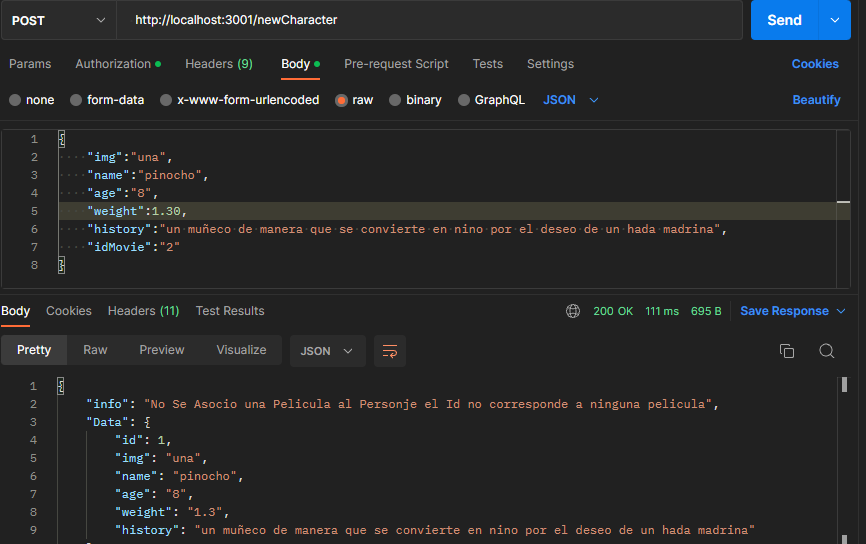

# Descripción: API Rest Disney

---

Desarrollar una API para explorar el mundo de Disney, la cual permitirá conocer y modificar los
personajes que lo componen y entender en qué películas estos participaron. Por otro lado, deberá
exponer la información para que cualquier frontend pueda consumirla.


# Documentacion de endpoints 

---

### Registro

 - POST http://localhost:3001/auth/register

Primeramente para poder acceder a los endpoints para realizar consultar y modificaciones es necesario que se registre de la siguiente manera


```javascript
{
    "userName":"josrenyer",
    "name":"jose",
    "lastName":"rangel",
    "email":"jl.rangel20@hotmail.com",
    "password":"1234"
}
```

### Login

 - POST http://localhost:3001/auth/login

 Luego de haber completado el registro, sera necesario hacer el login para que pueda obtener un token de acceso. El mismo debera utilizarlo en la Authorization de cada endpoints.


 

```javascript
{
    "userName":"josrenyer",
    "password":"1234"
}
```

### Auth

El tipo de Authorization debe ser Bearer Token, para luego copiar el Token que se le fue dado en el login.

 


## Character

 - GET  http://localhost:3001/character

Este endpoints permite obterner todos los personajes creados de la Base de Datos.


- POST  http://localhost:3001/newCharacter

Aqui se podra Crear los Personajes pra ir creando la API




```javascript
{
    "img":"una",
    "name":"pinocho",
    "age":"8",
    "weight":1.30,
    "history":"un muñeco de manera que se convierte en nino por el deseo de un hada madrina",
    "idMovie":"2"
}
```


- DELETE  http://localhost:3001/deleteCharacter

En este endpoints podremos eliminar un personaje de la Base de Datos.


```javascript
{
    "id":"1"
}
```


 - PUT  http://localhost:3001/editCharacter

 Con el siguiente endpoints se podra modificar algunos o todos los atributos del personaje.

 

```javascript
{
    "id":"2",
    "age":"9",
    "weight":"1.60"
}
```